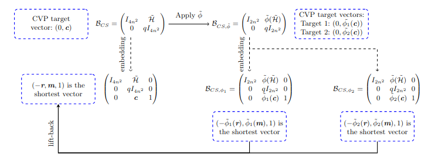
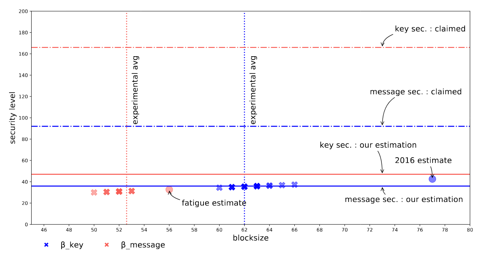

# Giant Does NOT Mean Strong: Cryptanalysis of BQTRU
This repository contains the scripts accompanying the article

## Providing experimental results to show the efficiency of our proposed folding attack against BQTRU.

# Requirements

* [fpylll](https://github.com/fplll/fpylll)

* [SageMath 9.5+](https://www.sagemath.org/) 


# Description of files
Short description of the content:
* `attack.py` main file to run lattice reduction attack on BQTRU lattices
* `BQTRU.py` contains the functions for key generation, encryption, and decryption for BQTRU.
* `utils.py` contains helping functions
* folder `keys_dumps\bqtru` contains  two subfolders, `records` and `seeds.`
  * subfolder `records` contains records for the trials that have been executed for key recovery attack against the parameter sets 
    ;The records save `f`,`g` as in the original key, `norm`: the key norm,`h`: the public key,`k1 (non-ternary)`: a possible non-ternary key found
    ,`k1-norm`: its norm,`k2 (ternary)`: a possible ternary key found,`k2-norm`: its norm,`beta1`: the blocksize to find the non-ternary
  ,`beta2`: the blocksize to find the ternary,`guessed T`: the guessed set T, `guessed v(lagrange)`: the guessed v with respect to Lagrange basis
  ,`guessed v(monomial)`: the guessed v with respect to monomial basis,`total time (seconds)`: the total time in seconds to run the attack 
  * subfolder seeds: reports the seeds for the executed trials against the parameter sets  
  
* Similarly, folder `meessage_dumps\bqtru` contains two subfolders `records` and `seeds` for the trials executed for 
message attack.
Each record in the message attack contains the following data:
`h`: the public key,`c`: the ciphertext,`original: m`: the original message,`original: r`: the original r used in the encryption equation 
,`retrieved: m`: the retrieved message,`retrieved: r`: the retrieved r,`beta`: the blocksize at which successfully we get r and m,
`total time (seconds)`: the total time in seconds to run the attack.

Each file named as `n_q_file-tag_machine-tag`, where `n`is the number of coefficients in the public key, `q` is the used 
modulo `q`, `file-tag`: either `no_reduction` (folding attack is not applied), or `reduction` (folding attack is applied),
and finally `machine tag`: the tag of the machine used to run the experiment; we have used the following machines with the following 
specifications:
* `M1`: system Linux (Ubuntu 22.04.2 LTS) with Intel(R) Xeon(R) CPU E3-1246 v3  and 32 GB installed RAM equipped with 4 cores; each core can run up to 2 threads.
* `M2`: system Linux (Ubuntu 22.04.2 LTS) with 13th Gen Intel(R) Core(TM)i7-13700 @ 800 MHZ (min) and 32 GB RAM  equipped with 16 physical cores; each core can 
run up to 2 threads(Timed results on this device).
* `M3`: system Linux (Ubuntu 22.04.2 LTS) with Intel(R) Core(TM) i9-10980HK CPU @ 2.40GHz and 800 MHZ (min) and 32 GB RAM equipped with 8 cores; 
each core can run up to 2 threads.


# How to use

Run `attack.py` with the following parameters.
python attack.py 196 'check_for_7' --verbose=True --dump=True --bkz_betas=3:50 --trials=15 --option=0 --weak_instance=True --guess=False --attack_type=1 --option=1

* `n`: Integer. Obligatory parameter defines the order used in BQTRU, i.e., the number of the coefficients in the private key. In BQTRU, this order is $4{n^\prime}^2$
for $ n^\prime=5,7,11,...$.
* `-q`: BQTRU modulus. If not entered, it is calculated as the first prime such that $ {n^\prime}|(q-1) $ and achieves no
decryption failure.
* `--option`: `0` or `1` (default `0`). `0` means no dimension reduction, and `1` indicates applying dimension reduction.
* `--weak_instance`: `True` or `False` (default `True`). `True` refers to generating the key as in BQTRU paper `Algorithm 1` in our paper, and
`False` refers to generating the key as in the first trials to fix BQTRU `Algorithm 2`.
*  `--attack_type`: `0` or `1` (default `0`). `0` means key attack, and `1` refers to message attack.
* `--guess`: `True` or `False` (default `False`). `False` means do not guess the set `I`, assumes it is guessed correctly and directly performs the 
lattice reduction attacks, and `True` means guessing all the possible sets for `I` and trying the lattice reduction (the latter option takes the maximum time as 
it performs the guessing+lattice reduction for every guessed set `I`).
* `--seed`: randomness seed to generate a key and build the corresponding lattices. If not entered, it will be generated randomly. The random seed is a tuple of the form
  `(fseed, (g_0 seed, g_1 seed, g_2 seed, g_3 seed ))`, where `fseed` is the seed used to generate the secret key `f = f_0+f_1i + f_2j + f_3 k` 
and `g_i seed` is the seed used to generate the `g_i` in the private vector `g_i`. 
* 
* `--bkz_betas`: a string as 'b1:b2', where b1 indicates the first blocksize and b2 indicates the last blocksize
to try upon running progressive bkz.
* `--dump`: True to save the results into files, False otherwise.
* `--verbose`: True to print detailed output in the console while running the program, False otherwise.
* `--filename`: the file's name where to save the results. If not entered, it is generated as `n_q`
*  `file_tag`: Obligatory. String that is used as a suffix for the file name.
* 

Parameters related to running experiments in parallel: 
* `-t` (or `--trials`): number of experiments to run per GR-NTRU dimension 
* `-w` (or `--workers`): number of parallel experiments to run
* `--threads`: number of threads used by one worker


# Experiments

## Key recovery attack

a) `No dimension reduction`:

* You can launch the key attack(naive way) with no dimension reduction by applying no homomorphisms.
In this attack, we guess the set `T` and then run the lattice reduction using progressive BKZ with no dimension
reduction.

```
python attack.py 100 'no_reduection' --verbose=True --dump=True --bkz_betas=3:20
```

The previous command generates a random seed and an instance corresponding to the seed and runs the attack.
It runs progressive BKZ for BQTRU lattice generated with default options, assuming that the set `I` has 
been guessed correctly.
The previous command takes, on average, 2 minutes on a laptop and solves the SVP in the lattice of dimension `200`.

Beyond this value, we cannot retrieve the secret key without applying dimension reduction,
as $n^\prime=7$ leads to $n=4{n^\prime}^2=196$, and therefore, for a correctly guessed set `T,` in order to find the key,
the lattice dimension to be reduced is `392`. Therefore, the ultimate cost of the attack is $ \left( \sum_{i=0}^{7}\ {49 \choose i} * \text{cost of lattice reduction} \right)$.


The set `T` has a small cardinality in practice, one can parallelize the guessing part as well. 
Hence, For each guessed set `T,`  the attacker builds the associated lattice
and applies lattice reduction.
The lattice reduction cost that is a function of the lattice dimension and the lattice gap.
The dimension of the associated lattice with $n^\prime=7$ is larger than the solved record for NTRU-like lattices of dimension `362` as 
reported in [NTRU new records](https://eprint.iacr.org/2023/582.pdf), and therefore it's difficult to retrieve the key experimentally
in such dimension without applying our defined homomorphisms (see Key recovery attack: section b).


b) `With dimension reduction`:

* b.1) if the set `T` has been guessed correctly, then the key can be recovered easily by launching the following command
that reduces the lattice dimension according to the homomorphisms introduced in the paper.

For $n^{\prime}=7$,  instead of solving the SVP in a lattice of dimension 392, the defined homomorphism solves the SVP in a lattice of 
dimension 196. The defined  homomorphisms decrease the lattice dimension  by a factor of `2` and keep the lattice dimension almost unchanged.

```
python attack.py 196 'reduection' --verbose=True --dump=True --bkz_betas=3:20  --option=1
```
* The previous command generates `q=547` as `7|(q-1)`, and the selected value of `q` guarantees no decryption failure.
* Running one instance, as in the previous command, takes approximately 5 minutes on a single core of a laptop to retrieve 
a possible decryption key.

In order to attack the exact parameter set proposed in [BQTRU](https://link.springer.com/content/pdf/10.1007/s10623-017-0451-4.pdf), 
which have a smaller value of `q` (and high decryption failure rate), we run the command to identify the value of `q`

```
python attack.py 196 'reduection_bqtru_paper' -q=113 --verbose=True --dump=True --bkz_betas=3:20  --option=1
```

* The lattice gap for `q=113` is much smaller compared to the case which allows zero decryption failure therefore the 
lattice reduction for lattices of the same dimension will take more time to retrieve a possible decryption key.

* For instance, one instance to retrieve the key according to the previous command finds a decryption key at blocksize
$\beta \approx 52$ and takes 8 hours on average on a single core of a laptop.


* b.2) Fully automated attack: for the sake of completeness, we report the cost of the fully automated key recovery attack
that takes into consideration the cost of the search for `T` and applying the lattice reduction on a single core.

To launch the fully automated attack against the key, we enable the `guess ` flag as the following:
```
python attack.py 196 'reduection_bqtru_paper' -q=113 --verbose=True --dump=True --bkz_betas=3:20  --option=1 -guess=True

```
For every guessed set `T`, the previous command applies the lattice reduction and search for a possible decryption key.

On average, for the moderate parameter set of BQTRU, this command takes `12 core days` on a laptop.

For instance for the following seed `(5009164915004678619, (2161621714291647112, 12621217469982390358, 6723073299635622167, 936773917163686685))`:

The public key is 
``` gives h
81, 27, 11, 94, 103, 102, 34, 73, 76, 26, 103, 86, 111, 22, 64, 93, 6, 15, 110, 76, 90, 58, 64, 10, 102, 61, 83, 47, 67,
7, 4, 38, 75, 90, 66, 18, 42, 27, 31, 72, 81, 105, 75, 28, 49, 82, 78, 103, 64, 45, 104, 31, 97, 1, 0, 32, 29, 54, 96,
75, 40, 30, 30, 47, 89, 9, 33, 27, 72, 23, 78, 86, 56, 77, 21, 87, 60, 86, 50, 107, 4, 77, 98, 72, 31, 9, 81, 100, 19, 
100, 14, 24, 55, 104, 37, 0, 42, 96, 92, 62, 96, 25, 34, 11, 94, 106, 29, 105, 87, 35, 27, 49, 98, 106, 50, 67, 21, 70, 
95, 23, 91, 14, 71, 87, 56, 37, 25, 51, 97, 43, 44, 56, 82, 28, 94, 24, 78, 69, 56, 33, 44, 9, 63, 49, 67, 68, 99, 22, 
56, 20, 69, 60, 4, 71, 36, 35, 40, 85, 26, 108, 57, 77, 14, 64, 27, 90, 71, 81, 11, 29, 23, 52, 20, 70, 57, 111, 29, 4, 
84, 85, 69, 64, 92, 48, 89, 67, 0, 57, 61, 56, 88, 60, 112, 5, 90, 65
```

calculated from:

$f=$

```
1, 1, 0, 0, -1, -1, 0, 0, 0, 0, -1, -1, 0, 1, 0, -1, 0, 0, 0, 0, 1, 0, 0, 0, 0, 0, 0, 0, 0, 0, 0, 0, -1, 1, 0, 0, 0, 1, 
0, 0, 0, 1, 0, -1, 0, 1, 0, 0, 0, 0, -1, 0, 0, 0, 0, 0, 0, -1, 1, 0, 0, -1, 1, 0, 1, 1, 0, 0, 0, 1, 0, 0, 0, 0, 0, 0, 0,
0, 0, 0, 0, 0, 0, 0, 0, 0, 0, 0, 1, 0, -1, 1, -1, -1, 0, -1, 0, 0, 1, 0, 1, -1, 0, 0, 1, 0, 1, 0, 0, 0, 0, 1, 0, -1, 0,
-1, 0, 1, 0, 0, 0, 0, 0, 0, 0, 0, 0, 0, 0, 0, 0, 0, 0, 0, 0, 1, -1, 0, 0, 0, 0, 0, -1, 0, -1, -1, 0, -1, -1, 0, 0, 1, 0, 
0, 0, 1, 0, 0, -1, 0, 0, 1, 0, 0, 0, 0, -1, 0, -1, 0, 0, 0, 0, -1, 0, 0, 1, 0, 0, 0, 0, 0, 0, 0, -1, 0, 0, 1, 0, 0, 0, 1, 
0, 0, 0, 1
```

$g=$
```
0, 0, 0, 0, 0, 0, -1, 0, 0, -1, 1, 0, 0, 0, 0, 0, 0, 0, 0, 0, -1, 1, 0, 0, 0, 0, -1, 0, 1, 0, -1, 0, 0, 0, -1, 0, 0, 0, 
0, 0, 0, 1, 0, 0, -1, 1, 1, 1, 0, 0, 0, 0, 0, 0, 0, -1, 1, 0, 0, 0, 0, -1, 0, -1, 0, 0, 0, -1, 0, 0, 0, 1, 0, 1, 1, -1,
0, 0, 1, 0, 0, 0, 0, 0, 0, 0, 1, 0, 0, 0, 0, -1, -1, 1, 0, 0, 0, 0, 0, 0, 0, 0, 1, -1, 0, 0, 0, 0, 0, 0, 0, 0, 0, 1, -1, 
0, 0, 0, 0, 0, 0, 0, 0, 1, 0, -1, 0, 0, 1, 0, 0, -1, 1, 0, 0, 1, -1, 0, -1, 0, 0, 0, -1, 0, 1, 0, 0, 0, 1, -1, 0, 1, -1, 
0, 0, 0, 0, 0, 0, 0, 0, 1, 0, 0, -1, 0, -1, 0, 0, 0, 1, 0, -1, 0, -1, 0, 0, 0, 0, 0, 1, 0, 0, -1, 0, 0, 0, 0, 1, 0, 1, 0, 
0, 0, 0, 0
```
and $v=$

```
62, 105, 46, 56, 16, 63, 101, 105, 46, 56, 16, 63, 101, 62, 46, 56, 16, 63, 101, 62, 105, 56, 16, 63, 101, 62, 105,
46, 16, 63, 101, 62, 105, 46, 56, 63, 101, 62, 105, 46, 56, 16, 101, 62, 105, 46, 56, 16, 63, 39, 46, 18, 17, 21, 5, 69,
46, 18, 17, 21, 5, 69, 39, 18, 17, 21, 5, 69, 39, 46, 17, 21, 5, 69, 39, 46, 18, 21, 5, 69, 39, 46, 18, 17, 5, 69, 39, 
46, 18, 17, 21, 69, 39, 46, 18, 17, 21, 5, 62, 105, 46, 56, 16, 63, 101, 105, 46, 56, 16, 63, 101, 62, 46, 56, 16, 63, 
101, 62, 105, 56, 16, 63, 101, 62, 105, 46, 16, 63, 101, 62, 105, 46, 56, 63, 101, 62, 105, 46, 56, 16, 101, 62, 105, 46,
56, 16, 63, 46, 5, 56, 78, 103, 3, 64, 5, 56, 78, 103, 3, 64, 46, 56, 78, 103, 3, 64, 46, 5, 78, 103, 3, 64, 46, 5, 56, 
103, 3, 64, 46, 5, 56, 78, 3, 64, 46, 5, 56, 78, 103, 64, 46, 5, 56, 78, 103, 3
```

The key recovery attack can find a possible decryption key by guessing the correct $T=\{0, 24\}$ (consequently retrieving 
the correct $v$) and retrieving possible $f^\prime$
and $g^\prime$ that satisfy the key equation.

For the above seed, our attack retrieve same $v$ and the following decryption key compiled as $(g^\prime, f^\prime)$ 
at blocksize `53`.

$(g^\prime, f^\prime)$
```
0, 0, 1, 1, 0, -1, 0, 1, 0, 0, 0, 0, -1, 0, 0, 0, 0, 0, 0, 0, 0, 0, 0, 0, 1, -1, 0, 0, 0, -1, 0, 0, 0, -1, 0, 1, 0, -1,
0, 0, 0, 0, -1, 0, 0, 1, 1, 0, -1, 1, -1, 0, 0, 1, -1, 0, -1, -1, 0, 0, 0, -1, 0, 0, 0, 0, 0, 0, 0, 0, 0, 0, 0, 0, 0,
0, 0, 0, 0, 0, -1, 0, 1, 0, 1, 1, 0, 1, 0, 0, -1, 1, 0, 0, 0, 0, 0, 0, -1, 0, 0, 0, 0, -1, 0, 1, 0, 1, 0, -1, 0, 0, 0,
0, 0, 0, 0, 0, 0, 0, 0, 0, 0, 0, 0, 0, 0, -1, 1, 0, 0, 0, 0, 0, 1, 0, 1, 1, 0, 0, 0, -1, 1, 0, 0, -1, -1, -1, 0, 0, 1,
0, 0, 0, 0, 0, 0, 0, 1, 0, -1, 0, 0, 0, 0, 1, 0, 1, -1, 0, 0, 0, 0, 0, 0, 0, 1, 0, 0, -1, 0, 0, 0, -1, 0, 0, 0, -1, 0, 
1, 0, 0, -1, 0, 0, 1, 0, 0, 1, 1, 0, -1, 0, 1, 0, 0, 0, 0, -1, 0, 0, 0, 0, 0, 0, 0, 0, 0, 0, 0, 1, -1, 0, 0, 0, -1, 0, 
0, 0, -1, 0, 1, 0, -1, 0, 0, 0, 0, -1, 0, 0, 1, 1, 0, -1, 1, -1, 0, 0, 1, -1, 0, -1, -1, 0, 0, 0, -1, 0, 0, 0, 0, 0, 0,
0, 0, 0, 0, 0, 0, 0, 0, 0, 0, 0, 0, -1, 0, 1, 0, 1, 1, 0, 1, 0, 0, -1, 1, 0, 0, 0, 0, 0, 0, -1, 0, 0, 0, 0, -1, 0, 1, 0,
1, 0, -1, 0, 0, 0, 0, 0, 0, 0, 0, 0, 0, 0, 0, 0, 0, 0, 0, 0, -1, 1, 0, 0, 0, 0, 0, 1, 0, 1, 1, 0, 0, 0, -1, 1, 0, 0, -1, 
-1, -1, 0, 0, 1, 0, 0, 0, 0, 0, 0, 0, 1, 0, -1, 0, 0, 0, 0, 1, 0, 1, -1, 0, 0, 0, 0, 0, 0, 0, 1, 0, 0, -1, 0, 0, 0, -1, 
0, 0, 0, -1, 0, 1, 0, 0, -1, 0, 0, 1
```


The total cost of the full automated attack takes `11.7 core days` on our system with the following specifications:

Linux (Ubuntu 22.04.2 LTS) with 13th Gen Intel(R) Core(TM) i7-13700  equipped with 16 physical cores @ minimum CPU clock
of 800 MHZ and 32 GB RAM; each core can run up to 2 threads on parallel


## Message recovery attack

a) `No dimension reduction`:

As in the NTRU cryptosystem, the message recovery attack can be translated to find the closet vector to
$(\textbf{c},\textbf{0}_n)$ which lies in the lattice generated from the basis
$$
  \mathcal{B}_{CS} = \begin{pmatrix}
    q_n & 0      \\
    \mathcal{S} & I_n \\
\end{pmatrix}
$$

where the vector $\textbf{c}$ is the vector corresponding to the ciphertext and $\mathcal{S}$ is the group ring NTRU matrix associated with BQTRU.

To identify the smallest blocksize needed to solve the CVP, we follow the common embedding technique that converts solving the CVP in a $n$-dimensional lattice into solving the uSVP in a $(n+1)$-dimensional lattice generated from the basis.

$$
  \mathcal{B^\prime}_{CS} = \begin{pmatrix}
    q_n           & 0_n         &   0    \\
    \mathcal{S}   &  I_n        &   0     \\
     \textbf{c}   & 0 \ldots  0 &   1 
\end{pmatrix}
$$

The following command launches a message recovery attack against BQTRU for $n=100 (i.e., n^\prime = 5)$ by generating a random key message and encrypting it, then performing the embedding into uSVP. 

```
python attack.py 100 'no_reduection' --verbose=True --dump=True --bkz_betas=3:50 --attack_type=1
```

The previous command retrieves the message at blocksize $18$, on average,  and takes almost $15$ core minutes on a laptop.

Beyond this dimension, we can't run the experiment to retrieve the message for larger parameter sets without considering the 
homomorphisms defined in the paper for the message recovery attack.

As for $n^\prime =7$, the value of $n=196$ and, therefore the lattice dimension where one needs to apply the lattice reduction is $392$

b) `With dimension reduction`:

This subsection applies the message attack after employing the folding attack mentioned in subsection 5.2 in the paper.
As summarized in the following figure



First, to show the benefit of our dimension reduction (folding) attack, we run the same command for the message recovery
for `n=100` with the flag `--option=1`, which means that the attack considers one layer of the dimension reduction and the
message is retrieved at blocksize $2$ or $3$ and takes less than $1$ seconds, approximately. 

For the actual parameter set of BQTRU $(n=7, q=113)$, we run the following command:

```
python attack.py 196 'reduection' --verbose=True --dump=True --bkz_betas=53:75 --attack_type=1 --option=1
```

We retrieve the message with blocksize on average $63$ and take on our device almost $10$ core days. 

## How not to fix BQTRU
Running the key attack with the flag `--weak_instace=False,` generate the key according to the modified algorithm 
(Algorithm 2) in the paper and perform the lattice reduction against the lattice generated from the basis 
$\mathcal{B}_{CS, \phi}^{new}$. The lattice reduction algorithm takes needs slightly higher blocksize to reduce the lattice
compared to the lattice generated according to the original key generation process in BQTRU (Algorithm 1 in our paper).

However, it does not thwart the proposed folding attack.

As a summary, we can break the moderate parameter sets of BQTRU.



